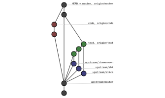

# Welcome

_Due Monday, June 29th, before midnight Pacific Time._

Welcome to CS 24!  This assignment will make sure you have  Git set up correctly
and are ready to submit your programming projects to Gradescope.


## Git Repo Setup

This class  will use a  single Git repo  for the whole quarter.  Each assignment
will get its own folder within  that repo.  You'll create  a private fork of the
main class repo; I'll push code to the main repo as assignments are released and
you can pull to get the code.

Normally you'd just fork the main repo on GitHub, but since GitHub doesn't allow
private forks of public repos, this'll be a little more complicated.

First, get a copy of the main repo onto your local machine:

- [Install and configure Git][git-setup] if you don't have it already.
- Clone the main repo somewhere on your local machine.

Then create an empty repo on GitHub:

- Create an account on [GitHub][github] if you don't already have one.
- Create a new repo on GitHub.
  - Don't initialize it with any files.
  - Make sure it's private.

Finaly, configure your local repo to talk to both GitHub repos:

- The main repo will be at a remote named `origin`.  Rename it to `upstream`.
- Add a new remote for your GitHub repo.  Name it `origin`.
- Push your local `master` branch to your GitHub repo.
- Your files should now be visible in the GitHub web UI.


## Git Branches

Now that your repo is set up, get some practice with branches and merging:

- Create a branch named `welcome-text` off of `master`.
- Merge the following branches from the main repo into your new branch:
  - `alice`
  - `shi`
  - `zimmermann`
- Push your `welcome-text` branch to GitHub.


## Some Code

Then write some code  in another branch.  Make sure you don't include any of the
commits from the `welcome-text` branch in this one.

- Create a new branch named `welcome-code` off of `master`.
- In that branch, create the folder `welcome/code`.
- Create a `Makefile` inside your `welcome/code` folder.
  - Running `make` in that folder should compile `olleh.cpp` to `olleh`.
  - Running `make clean` in that folder should remove `olleh` if it exists.
- Create an `olleh.cpp` file in the same folder.  It should compile to a program
  that takes a `<name>` as a command-line argument  and prints  `Hello, <name>!`
  _backwards_,  followed by a newline:
  ```
  [user@host code]$ ./olleh Alice
  !ecilA ,olleH
  [user@host code]$ 
  ```
- Commit your code and Makefile to your `welcome-code` branch.
- Push your `welcome-code` branch to GitHub.


## Merge and Submit

- Merge both of your `welcome-*` branches into `master`.
  - If you use a GitHub PR, make sure that you don't delete the source branch.
  - If you use a GitHub PR, make sure you pull from GitHub afterwards.
  - If you don't use a PR, make sure push to GitHub afterwards.
- Save the output of `git remote -v` as `welcome/remotes.txt`.
- Save the output of `git --no-pager log --pretty="%H %P %d"` as `welcome/commits.txt`.
- Commit these files to your `master` branch and push to GitHub.
- Submit the `master` branch of your GitHub repo to Gradescope.
- You'll be asked to connect your GitHub account to Gradescope if you haven't already.


## Hints

- If you change your Git history,  regenerate `welcome/commits.txt`  (the grader
  uses that file  to check your history).  Make sure you sync  all your branches
  with GitHub before you recreate the file.
- If you do this assignment  on multiple computers,  use  `git fetch` to get all
  the branches you need locally.
- You can use `git log --oneline --graph` to look at the history of your current
  branch in the terminal.
- If you did everything correctly, your Git history will look something like this:
  

[github]: https://github.com
[git-setup]: https://help.github.com/en/github/getting-started-with-github/set-up-git
